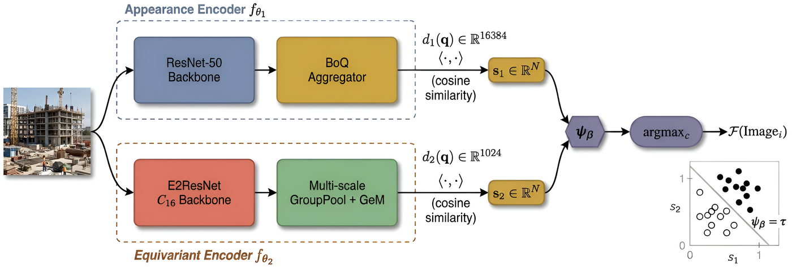

Here is the complete raw Markdown code for your `README.md`. You can copy and paste this directly into your file.

````markdown
# DR-VPR: Dual-Branch Rotation-Robust Visual Place Recognition

<div align="center">

[](https://arxiv.org/abs/...) 
[](https://pytorch.org/) 
[](LICENSE)

**State-of-the-art Visual Place Recognition for Dynamic Construction Environments**

</div>

## 📖 Introduction

This repository contains the official implementation of **DR-VPR**, a dual-branch architecture designed for robust localization in dynamic construction sites using handheld devices or UAVs.

**Key Insight:** Instead of forcing a standard CNN to "memorize" rotation invariance through massive data augmentation (which we prove degrades discriminability), we explicitly encode geometric priors using a rotation-equivariant branch.

**Highlights:**
- 🏆 **SOTA Performance:** Outperforms MixVPR and CosPlace on **ConPR** (+1.6%) and **ConSLAM** (+3.5%) benchmarks.
- ⚡ **Real-Time Latency:** Extremely fast inference (**4.23 ms** on RTX 6000) suitable for embedded robotics.
- 🔄 **Equivariance > Augmentation:** Empirically resolves the *invariance-discriminability trade-off*, achieving superior robustness without explicit rotation augmentation training.

## 🏗️ Architecture


*Figure: Overview of DR-VPR. Branch 1 (ResNet-50 + MixVPR) captures discriminative semantic features, while Branch 2 (E2ResNet + GeM) ensures mathematical rotation invariance. An attention mechanism dynamically fuses these cues.*

## 🛠️ Installation

Our environment uses **PyTorch 2.0.1** with **CUDA 11.8**. Please follow the steps below to ensure compatibility.

1. **Clone the repository**
   ```bash
   git clone [https://github.com/YuhaiW/DR-VPR.git](https://github.com/YuhaiW/DR-VPR.git)
   cd DR-VPR
````

2.  **Create a Conda environment**

    ```bash
    conda create -n drvpr python=3.9
    conda activate drvpr
    ```

3.  **Install PyTorch (CUDA 11.8)**
    *It is critical to install this before the other requirements.*

    ```bash
    pip install torch==2.0.1+cu118 torchvision==0.15.2+cu118 torchaudio==2.0.2+cu118 --extra-index-url [https://download.pytorch.org/whl/cu118](https://download.pytorch.org/whl/cu118)
    ```

4.  **Install Dependencies**

    ```bash
    pip install -r requirements.txt
    ```

## 📂 Data Preparation

### 1\. GSV-Cities (Training)

Download the [GSV-Cities dataset](https://github.com/amaralibey/gsv-cities). The code expects the following structure in `./datasets/`:

```text
datasets/
└── GSV-Cities/
    ├── Dataframes/   # Contains .csv files (Bangkok.csv, etc.)
    └── Images/       # Contains city folders (Bangkok/, etc.)
```

### 2\. Evaluation Datasets

  - **Pittsburgh 30k:** Automatically handled by the dataloader.
  - **ConPR:** Download from [ConPR Official](https://www.google.com/search?q=https://github.com/sh8/ConPR).
  - **ConSLAM:** Download from [ConSLAM Project](https://www.google.com/search?q=https://github.com/lab-con/ConSLAM).

## 🚀 Training

To train the dual-branch model. Note that we **do not** use rotation augmentation for DR-VPR, relying instead on the equivariant backbone.

```bash
python train_fusion.py \
    --backbone_arch resnet50 \
    --agg_arch MixVPR \
    --use_dual_branch \
    --equi_orientation 8 \
    --fusion_method attention \
    --batch_size 60 \
    --lr 0.04
```

## 📊 Evaluation & Results

To evaluate a trained checkpoint:

```bash
python eval.py --checkpoint_path LOGS/resnet50_DualBranch/best_model.ckpt
```

### Comparative Results (Recall@1)

| Method | ConPR (Construction) | ConSLAM (Handheld) | Inference Time |
| :--- | :---: | :---: | :---: |
| MixVPR (Baseline) | 78.55% | 56.90% | 29.4 ms |
| MixVPR + Rot. Aug. | 77.24% | 57.33% | 29.4 ms |
| **DR-VPR (Ours)** | **80.15%** | **60.40%** | **4.23 ms** |

*Inference time measured on NVIDIA RTX 6000 with batch size 1.*

## 🎓 Citation

If you use this code in your research, please cite our paper:

```bibtex
@article{wang2025drvpr,
  title={DR-VPR: Dual-Branch Rotation-Robust Visual Place Recognition for Dynamic Construction Environments},
  author={Wang, Yuhai and Hu, Xiao and Ye, Yang},
  journal={Automation in Construction (Submitted)},
  year={2025}
}
```

## 📄 License

This project is licensed under the MIT License.

```
```