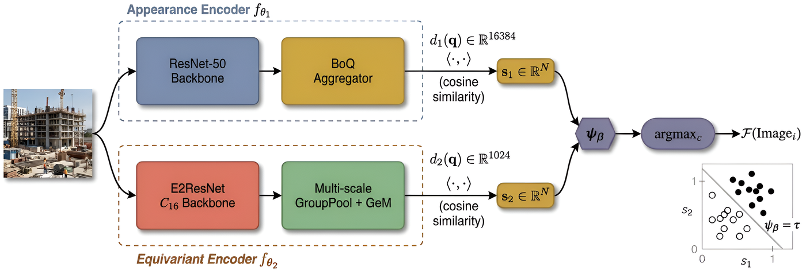
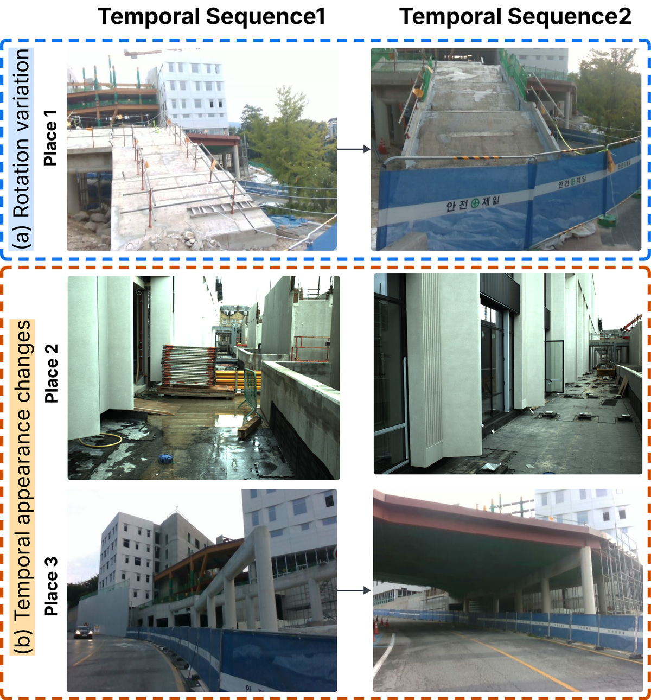
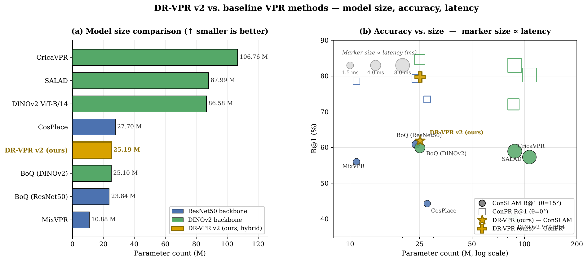
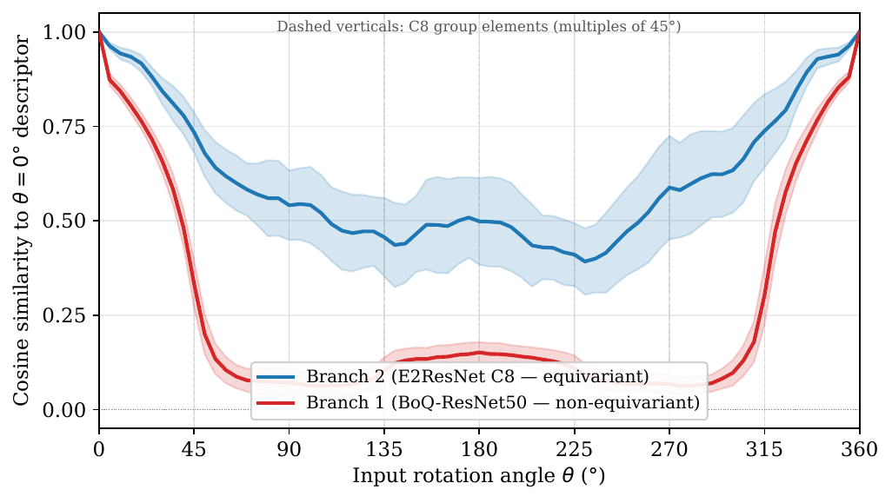

# DR-VPR: Dual-Branch Rotation-Robust Visual Place Recognition

<div align="center">

[](https://github.com/YuhaiW/DR-VPR)
[](https://pytorch.org/)
[](LICENSE)
[](#-results)

**Visual Place Recognition for handheld and UAV capture in dynamic construction environments**



</div>

## 📖 Overview

DR-VPR is a dual-branch retrieval architecture for VPR in construction sites, where handheld scanners and UAVs introduce **in-plane rotations** and **rapid scene evolution** that defeat conventional VPR methods.

<p align="center">

</p>

> **The challenge.** Handheld recording produces arbitrary in-plane rotations of the same scene (top), while construction progress causes dramatic structural change at the same physical location (bottom). Conventional VPR methods are not designed to handle both phenomena simultaneously.

**Architecture (one line).**
A frozen pretrained **BoQ-ResNet50** discriminative branch is paired with a lightweight **C₁₆-equivariant E2ResNet** branch (0.67 M parameters); the two branches are trained independently and combined only at inference through a weighted joint-scoring rule:

```
score(q, c) = (1 − β) · ⟨d₁(q), d₁(c)⟩ + β · ⟨d₂(q), d₂(c)⟩,    β = 0.10
```

**Why decoupled inference-time fusion?**
A systematic ablation in the paper (Table 4) shows that train-time attention or gated-concat fusion suffers from **branch-weight saturation** under strong pretrained features — the equivariant branch's weight collapses to ∼10⁻⁴ at inference. Inference-time joint scoring decouples the branches and recovers the full gain.

## 📊 Results

### ConSLAM (rotation-heavy handheld benchmark, 307 valid queries)

| Method | Backbone | Params (M) | Lat. (ms) | R@1 | R@5 | R@10 |
| :--- | :--- | ---: | ---: | ---: | ---: | ---: |
| CosPlace        | ResNet50 | 27.70 | 1.38 | 44.30 | 67.10 | 74.27 |
| MixVPR          | ResNet50 | 10.88 | 1.38 | 56.03 | 74.59 | 77.85 |
| BoQ (ResNet50)  | ResNet50 | 23.84 | 2.12 | 60.91 | 75.24 | 78.83 |
| **DR-VPR (ours)** | R50 + E2ResNet(C₁₆) | **24.51** | **4.24** | **62.65 ± 0.82** | **75.68 ± 0.50** | **79.80 ± 0.66** |

### ConPR (full 10-sequence cross-validation protocol)

| Method | Params (M) | R@1 |
| :--- | ---: | ---: |
| CosPlace | 27.70 | 73.48 |
| MixVPR   | 10.88 | 78.55 |
| BoQ (ResNet50) | 23.84 | 79.30 |
| **DR-VPR (ours)** | **24.51** | **79.81 ± 0.21** |

### Size-accuracy-latency Pareto

<p align="center">

</p>

DR-VPR is **3.5–4.2× smaller** than DINOv2-backbone baselines (SALAD 87.99 M, CricaVPR 106.76 M) at 4.24 ms per image on an RTX 5090, while delivering a statistically significant +1.74 R@1 improvement on rotation-heavy ConSLAM (one-sample _t_-test, _t_ = 3.67, _p_ < 0.05 across 3 seeds).

## 🔬 Equivariance Verification

<p align="center">

</p>

> **Cosine similarity between rotated-image descriptors and the 0° reference, sampled every 5° over the full 360° range.**
> Branch 1 (BoQ, red) **collapses to ≈ 0.10** for any rotation outside ±60° of the upright orientation — a moderately rotated view becomes essentially uncorrelated with its upright counterpart in BoQ feature space.
> Branch 2 (E2ResNet C₁₆, blue) **maintains substantial similarity throughout the full range**, with peaks at the 16 sampled C₁₆ group elements (multiples of 22.5°) where invariance is exact by construction. This is the feature-level basis for DR-VPR's rotation robustness.

## 🖼️ Qualitative Results

<p align="center">

</p>

> **Each row shows the query image (left), the DR-VPR top-1 match (middle, green border = correct), and the BoQ baseline top-1 match (right, red border = incorrect).** The four rows showcase distinct failure modes that DR-VPR resolves: in-plane rotation, low-light environment, distance variation, and construction-induced structural change.

## 🛠️ Installation

1. **Clone**
   ```bash
   git clone https://github.com/YuhaiW/DR-VPR.git
   cd DR-VPR
   ```

2. **Conda environment**
   ```bash
   conda create -n drvpr python=3.9 -y
   conda activate drvpr
   ```

3. **PyTorch** (pick the path matching your GPU)

   <details>
   <summary><b>Ampere / Ada Lovelace (RTX 30xx, 40xx, A100) — CUDA 11.8</b></summary>

   ```bash
   pip install torch==2.0.1+cu118 torchvision==0.15.2+cu118 torchaudio==2.0.2+cu118 \
       --extra-index-url https://download.pytorch.org/whl/cu118
   ```
   </details>

   <details open>
   <summary><b>Blackwell (RTX 5090, B100/B200) — CUDA 12.8</b></summary>

   ```bash
   pip install torch==2.8.0 torchvision==0.23.0 torchaudio==2.8.0 \
       --index-url https://download.pytorch.org/whl/cu128
   pip install "numpy<2"   # required for faiss-gpu compatibility
   ```
   </details>

4. **Other dependencies**
   ```bash
   pip install -r requirements.txt
   ```

| Verified GPU | PyTorch | CUDA | Python |
| :--- | :--- | :--- | :--- |
| RTX 6000 (Ada) | 2.0.1 | 11.8 | 3.9 |
| RTX 5090 (Blackwell) | 2.8.0 | 12.8 | 3.9 |

## 📂 Data Preparation

Place datasets under `./datasets/`.

### 1. GSV-Cities (training)
[Download GSV-Cities](https://github.com/amaralibey/gsv-cities) and arrange as:
```
datasets/GSV-Cities/
├── Dataframes/    # .csv files (Bangkok.csv, ...)
└── Images/        # city folders (Bangkok/, ...)
```

### 2. Construction benchmarks (evaluation)

| Dataset | Ready-to-run | Original source |
| :--- | :--- | :--- |
| **ConPR** | [Download (Drive)](https://drive.google.com/file/d/1IwfYyKhdu8hsoLxXQ7TrZabkawMt-Qge/view?usp=sharing) | [dongjae0107/ConPR](https://github.com/dongjae0107/ConPR) |
| **ConSLAM** | [Download (Drive)](https://drive.google.com/file/d/1uudYN0WuWhkMYqg-6-LFDL6ueFNCoI3D/view?usp=sharing) | [mac137/ConSLAM](https://github.com/mac137/ConSLAM) |

Extract under `./datasets/ConPR/` and `./datasets/ConSLAM/`.

## 🚀 Quick Start

This repository is a **code-only release**. To reproduce the paper's main number you need to train the small Branch-2 encoder (~6 h per seed on RTX 5090). Branch 1 (BoQ-ResNet50) is **never trained** — it is loaded frozen from the official Bag-of-Queries release at runtime via `torch.hub`, so no manual model download is required.

### 1. Train Branch 2 (3 seeds)

```bash
for seed in 1 42 190223; do
    python train_equi_standalone.py --seed $seed
done
```

Each seed trains a 0.67 M-parameter C₁₆-equivariant encoder on GSV-Cities for ~10 epochs and saves a val-best checkpoint under `LOGS/equi_standalone_seed${seed}_ms_C16/`.

### 2. Evaluate with joint scoring

```bash
python eval_rerank_standalone.py --dataset conslam --beta 0.10
python eval_rerank_standalone.py --dataset conpr   --beta 0.10
```

Expected: ConSLAM R@1 ≈ 62.65 ± 0.82, ConPR R@1 ≈ 79.81 ± 0.21 (3-seed mean ± std).

## 🧪 Reproducing the baselines

```bash
python eval_baselines.py --method all --dataset all --seeds 1 42 123
```

Evaluates **CosPlace, MixVPR, BoQ-R50, BoQ-DINOv2, SALAD, CricaVPR, DINOv2 alone** on both ConSLAM and ConPR, reporting R@1/5/10.

## ⏱️ Latency benchmarking

```bash
python benchmark_latency.py
# Reports forward-pass time on the available GPU at 320 × 320 resolution
```

## 📁 Repository layout

```
DR-VPR/
├── train_equi_standalone.py     # canonical Branch-2 trainer (paper main)
├── train_fusion.py              # joint train-time fusion entry (legacy / ablation)
├── eval_rerank_standalone.py    # canonical evaluator (paper main: BoQ + C16 standalone)
├── eval_rerank.py               # eval for full DualBranch checkpoints
├── eval_baselines.py            # 6 baseline evaluations
├── benchmark_latency.py         # inference-time measurement
├── test_conpr.py / test_conslam.py
├── conpr_eval_dataset_rot.py    # ConPR data interface
├── Conslam_dataset_rot.py       # ConSLAM data interface
├── models/                      # backbones, aggregators (BoQ, MixVPR, GeM), E2ResNet
├── dataloaders/                 # GSV-Cities + construction val sets
├── utils/                       # losses, validation helpers
└── assets/                      # README figures
```

<!--
## 🎓 Citation

```bibtex
@article{wang2026drvpr,
  title   = {DR-VPR: Dual-Branch Rotation-Robust Visual Place Recognition for Dynamic Construction Environments},
  author  = {Wang, Yuhai and Hu, Xiao and Shi, Yangming and Ye, Yang},
  journal = {Automation in Construction},
  year    = {2026}
}
```
-->

## 📄 License

MIT — see [LICENSE](LICENSE).
